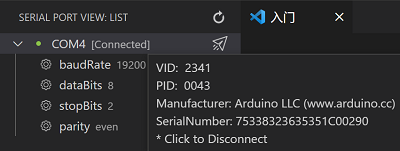
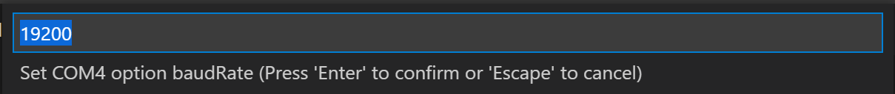

# Serial Port Helper

You can connect any serial port used to read / write data.

## Features

1. Serial Port View;  
   
2. Serial Port Config;  
   
3. TX / RX;  
   
   
4. Send Hex Buffer: Press send button, and then input `@hex` or `@hex:<your buffer byte>` to send Hex Buffer;  
5. Send File: Press send button, and then input `@file` or `@file:<your file path>` to send file.  

## Release Notes

### 0.0.4
- Update preview image size in readme.

### 0.0.3
- Add send hex buffer command.
- Add send file command

### 0.0.2
- Add support Chinese.
- Add options list in config serial port.
- Add remember last serial port config.

### 0.0.1

- First Version, only baise feature.

-----------------------------------------------------------------------------------------------------------
### For more information

* [Serial Port Icon](https://iconscout.com/icons/serial-port) by [Microsoft](https://iconscout.com/contributors/fluent)

**Enjoy!**
